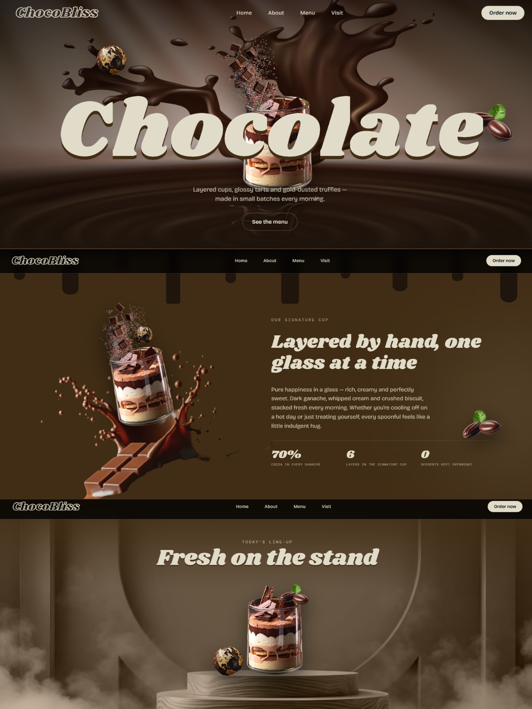
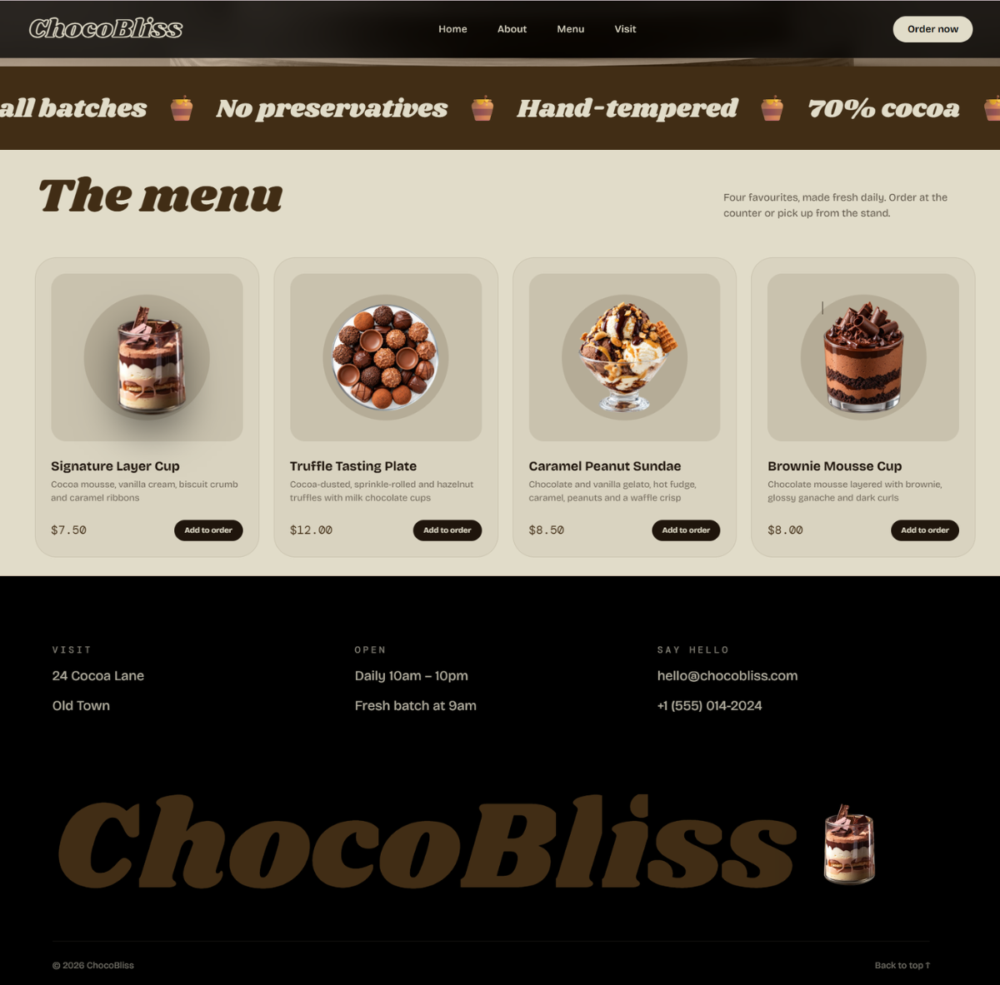

<h1 align="center">🧁 ChocoBliss</h1>

<p align="center">
  <strong>A scroll-driven dessert story, built with React and GSAP.</strong><br/>
  One signature glass travels the whole page, from the hero to the footer, while the rest of the dessert shop unfolds around it.
</p>

<p align="center">
  <a href="https://simple-chocobliss-site.netlify.app/"><strong>View the live site →</strong></a>
</p>

<p align="center">
  
  
  
  
</p>

<table>
  <tr>
    <td width="50%" valign="top"></td>
    <td width="50%" valign="top"></td>
  </tr>
  <tr>
    <td align="center"><sub><b>Hero → About → The stand</b></sub></td>
    <td align="center"><sub><b>Menu → Footer</b></sub></td>
  </tr>
</table>

---

## Design concept

ChocoBliss is a landing page for a small dessert bar. Instead of separate sections that each animate on their own, the page tells **one continuous story as you scroll**:

1. **Hero:** the signature layered cup floats over a giant word, *Chocolate*, surrounded by a truffle, cocoa beans and chocolate pieces.
2. **About:** chocolate drips pour down from the hero, and the desserts fly into the empty left half, so the story text on the right stays readable.
3. **The stand:** the desserts settle onto a wooden podium for a "fresh on the stand" moment.
4. **Menu:** the glass spins down into the first menu card, becoming the *Signature Layer Cup* you can order.
5. **Footer:** the glass comes to rest beside the **ChocoBliss** wordmark.

The look is warm and edible: a strict four-colour chocolate palette, a retro confectionery display face, and soft drop shadows that make the cut-out desserts feel like real objects on the page.

---


## Colour palette

Every colour on the page comes from four tones, plus see-through versions of them.

| | Token | Hex | Used for |
|:-:|---|---|---|
|  | `ink` | `#000000` | Footer background, solid navbar |
|  | `ganache` | `#1F150C` | Page background, chocolate drips, buttons |
|  | `cocoa` | `#412D15` | About section, marquee banner, headings on cream |
|  | `cream` | `#E1DCC9` | Text on dark, Menu section, primary button |

The colours live in one place, the `@theme` block in [`src/index.css`](src/index.css), so Tailwind classes like `bg-cocoa` and `text-cream` update everywhere when you change a value.

## Typography

| Role | Typeface | Where |
|---|---|---|
| Display | **Shrikhand** | Hero word, section headings, wordmark: a bold retro face with a confectionery-wrapper feel |
| Body | **Bricolage Grotesque** | Paragraphs, navigation, card text |
| Labels | **DM Mono** | Small eyebrow labels, prices, stats |

---

## Motion

All animation lives in one hook, [`src/hooks/useAnimation.js`](src/hooks/useAnimation.js), built on `useGSAP` so everything is cleaned up automatically.

| Moment | What happens | Technique |
|---|---|---|
| Page load | Navbar slides in, *Chocolate* rises letter by letter, desserts pop in | GSAP timeline with staggers and `back.out` easing |
| Idle | The truffle and chocolate pieces gently float | Looping `yoyo` tweens, paused once they reach the stand |
| Hero → About | Chocolate drips stretch down into the next section | Scrubbed `scaleY` on SVG drip shapes |
| Hero → About → Stand | Desserts fly between hand-placed positions | One scrubbed ScrollTrigger timeline |
| Stand → Menu → Footer | The glass spins into its menu card, then rests by the wordmark | Landing spots measured from the real layout, re-measured whenever the page height changes |
| Section reveals | Headings rise word by word; paragraphs, stats and cards fade up | `toggleActions` reveals with masked text |
| Ambient | The marquee banner scrolls endlessly | Infinite `xPercent` tween |

---

## Accessibility & responsiveness

- **Reduced motion:** visitors with *reduce motion* enabled get the same layout with no scroll choreography.
- **Phones:** the cross-section flight is replaced by a simple drift-and-fade, so small screens stay clean and fast.
- **Keyboard:** links and buttons show a visible cream focus ring.
- **Screen readers:** split-letter headings keep a readable `aria-label`, and decorative images are hidden from assistive tech.
- **Readable layout:** in About, the desserts land only in the left half, so they never cover the text.

---

## Project structure

```
src/
├── components/
│   ├── Navbar.jsx         # Fixed nav, turns solid on scroll
│   ├── Hero.jsx           # Hero word, flying desserts, SVG chocolate drips
│   ├── About.jsx          # Story copy, stats, chocolate splash
│   ├── BottomSection.jsx  # "Fresh on the stand" podium
│   ├── Menu.jsx           # Marquee banner + product cards
│   └── Footer.jsx         # Visit details + wordmark landing spot
├── hooks/
│   └── useAnimation.js    # Every GSAP timeline and ScrollTrigger
├── App.css                # Global styles and small effects
└── index.css              # Tailwind import, colour and font tokens
```

## Getting started

```bash
git clone https://github.com/Rain44556/chocobliss-with-GSAP.git
cd chocobliss-with-GSAP
npm install
npm run dev
```

| Command | What it does |
|---|---|
| `npm run dev` | Start the dev server with hot reload |
| `npm run build` | Build for production into `dist/` |
| `npm run preview` | Preview the production build locally |
| `npm run lint` | Check the code with ESLint |

